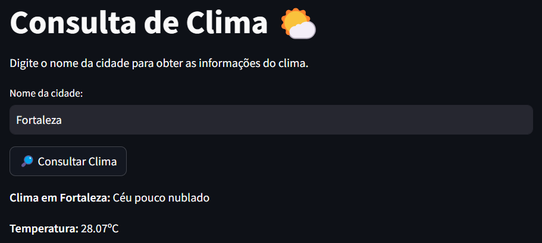
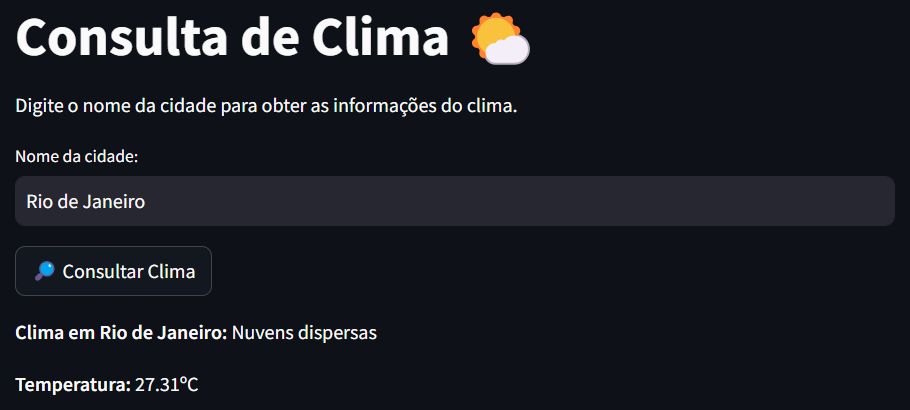

# **Consulta Meteorológica 🌤️🌡️**

Este projeto permite obter informações climáticas de qualquer cidade usando a API do OpenWeather. Ele possui uma interface interativa criada com Streamlit para facilitar a consulta do clima em tempo real.

## **📌 Funcionalidades**

- Permite que o usuário digite uma cidade;
- Apresenta a descrição do clima e temperatura;
- Exibe mensagem de erro caso não encontre a cidade.

## **🛠️ Tecnologias Utilizadas**

- `Python`
- `Streamlit`
- `OpenWeather API`
- `Requests`

## **📝 Configurar a API do OpenWeather**

Para utilizar a API do OpenWeather, você precisa de uma chave de API. Caso ainda não tenha:

1. Crie uma conta no [OpenWeather](https://openweathermap.org);
2. Gere uma chave de API;
3. Substitua a chave diretamente no arquivo `functions.py`, na função `get_weather()`:

```python
api_key = "SUA_CHAVE"
```

## **🖼️ Exemplos de uso**

#### Teste 1 - Cidade: Fortaleza



#### Teste 2 - Cidade: Rio de Janeiro



## 🚀 Como executar?

### 1. Clonar o repositório

```bash
git clone https://github.com/Lucas-p00/weather-search.git
cd weather-search
```

### 2. Instalar as dependências

```bash
pip install requests streamlit
```

### 3. Executar o projeto

```bash
streamlit run main.py
```
